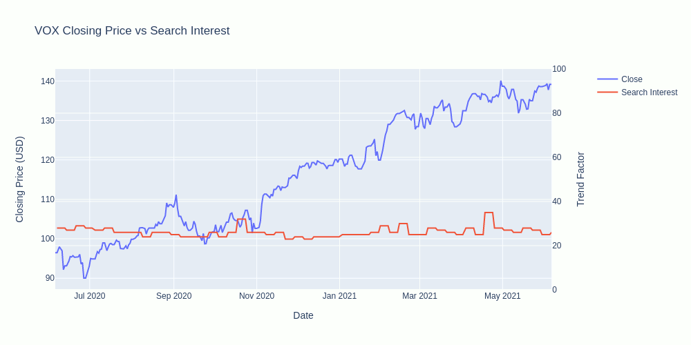

# Are "meme stocks" good investments?
## Introduction
Stocks like Gamestop and AMC have large support communities on social media.  These communities closely monitor the market and then coordinate campaigns with memes, giving rise to the term "meme stock", which garner more support from their followers who amplify and extend their circle of influence.  This tactic gives retail investors a larger voice, and some feel a better chance in the fight against the perceived threat of institutional investors.  Some of the leaders in these campaigns have a mission to hurt short-sellers, but some only want to pump the stock so that they can dump at its highest.  Among the casualties of this "war" are the casual investors who just buy because they see people telling them to on Twitter or Facebook then "hodl" (hold) through the ups and downs.  This study examines the correlation of search interest to stock performance alongside some more conventional, accessible methods of stock selection.  Politics and ethics aside, are these "meme stocks" good investments?

## Method
* Use Google Finance and Alpaca Trading APIs to get historical stock data for each of the 11 sectors in the S & P 500 with select stocks and funds
* Use Google Trends API to get search interest over time for stock tickers
* Use Pandas for Python to clean analyze the data
* Use Panel for Python to display the findings

## Data Visualizations

## Conclusion
There are ways to make money off of the "meme stocks", making them good investments in the short term around their trending period, as long as the investor has the time and understanding to take advantage of the opportunity.  Correlation with the S & P 500 index is proportional with beta value of each sector, the mutual fund correlated the most with a mean of 86% across all sectors. The median beta value had higher mean correlation (54%) than the maximum beta value (52%) and minimum beta value (35%). There can be correlation between search interest and closing price, but it is not a reliable sign to buy.  Often the trend increase is directly over the increase in price. The analysis does not indicate that they are sound long-term investments, not on their meme value alone.  Investing in single stocks based on social media campaigns does not provide the security of the conventional investing strategy of having a diversified portfolio of proven performers.  If someone is a casual investor or has a low threshold for risk or loss, they are better off investing in a carefully managed fund like SPY.

## References
* [Plotly Express](https://plotly.com/python/plotly-express/)
* [Plotly Graph Objects in Python](https://plotly.com/python/graph-objects/)
* [Panel for Python](https://panel.holoviz.org/)
* [Google Trends API for Python](https://pypi.org/project/pytrends/)
* [Alpaca Trading API](https://alpaca.markets/docs/)
* [SPY Fund](https://www.ssga.com/us/en/institutional/etfs/funds/spdr-sp-500-etf-trust-spy)

## Team Members
* Josh Ferguson
* Ben McCright
* Cole Wood
